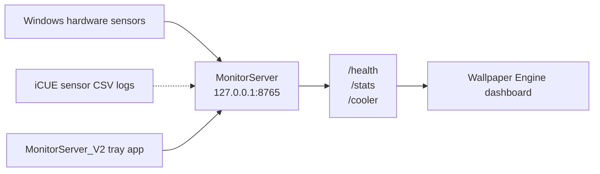

# System Monitor Dashboard

A local hardware-monitoring dashboard for Windows and Wallpaper Engine. A lightweight .NET service reads system sensors, while a dependency-free HTML, CSS, and JavaScript frontend displays real-time CPU, GPU, memory, network, motherboard, storage, and optional Corsair cooler data.

> [!NOTE]
> All data is collected and displayed locally. The server listens only on `127.0.0.1:8765` by default and is not exposed to your network or the internet.

## Features

- CPU temperature, load, power, clock speed, and CCD temperature
- GPU core, hotspot, and memory temperatures; load, power, VRAM usage, and fan speed
- Memory usage, capacity, load, and DIMM temperatures
- Active network adapter with live upload and download rates
- Motherboard temperature and fan sensors
- Storage capacity, usage, temperature, and health
- Optional Corsair iCUE liquid temperature, fan, and pump telemetry
- Three dashboard generations, with `Wallpaper_v3` as the current version
- Windows system tray controls for start, stop, restart, health checks, logs, and startup

## Architecture



## Repository Structure

```text
System_Monitor_Dashboard/
|-- MonitorServer/       # ASP.NET Core hardware data service
|-- MonitorServer_V2/    # Windows system tray controller
|-- Wallpaper_v1/        # First dashboard design
|-- Wallpaper_v2/        # Second dashboard design
|-- Wallpaper_v3/        # Current dashboard design
`-- start-monitor-server.bat
```

## Requirements

- Windows 10 or Windows 11
- [.NET 8 SDK](https://dotnet.microsoft.com/download/dotnet/8.0)
- [Wallpaper Engine](https://www.wallpaperengine.io/) if the dashboard will be used as a wallpaper
- Corsair iCUE only if cooler telemetry is required

Some hardware sensors may require administrator privileges. Available sensor names and values vary by device, driver, and motherboard implementation.

## Quick Start

Clone the repository and create your local configuration file:

```powershell
git clone https://github.com/Shengtao-Lin/System-Monitor-Dashboard.git
Set-Location System-Monitor-Dashboard
Copy-Item .env.example .env
```

Edit `.env` if needed, then start the server:

```powershell
dotnet restore .\MonitorServer\MonitorServer.csproj
dotnet run --project .\MonitorServer\MonitorServer.csproj
```

Check the server health:

```powershell
Invoke-RestMethod http://127.0.0.1:8765/health
```

The following local endpoints are available:

| Endpoint | Purpose |
| --- | --- |
| `GET /health` | Reports server health |
| `GET /stats` | Returns primary hardware sensor data |
| `GET /cooler` | Returns cached iCUE cooler data |

Open `Wallpaper_v3/index.html` in a browser to preview the current dashboard. It displays `OFFLINE` whenever the local service cannot be reached.

## Wallpaper Engine Setup

1. Start `MonitorServer`.
2. Open the Wallpaper Engine editor.
3. Create a web wallpaper and select `Wallpaper_v3/index.html`.
4. Save and apply the wallpaper.

The dashboard requests `http://127.0.0.1:8765/stats` once per second. `Wallpaper_v1` and `Wallpaper_v2` are retained as earlier design iterations.

## Build and Package

Publish the data service by itself:

```powershell
dotnet publish .\MonitorServer\MonitorServer.csproj `
  -c Release -r win-x64 --self-contained false `
  -o .\MonitorServer\publish
```

Run `start-monitor-server.bat` from the repository root after publishing. The script uses relative paths, so the project can be moved to another folder or drive.

To package the tray controller and server together, use this layout:

```powershell
dotnet publish .\MonitorServer_V2\MonitorServer_V2.csproj `
  -c Release -r win-x64 --self-contained false `
  -o .\dist

dotnet publish .\MonitorServer\MonitorServer.csproj `
  -c Release -r win-x64 --self-contained false `
  -o .\dist\MonitorServer
```

Launch `dist/MonitorServer_V2.exe`. The tray controller automatically locates `dist/MonitorServer/MonitorServer.exe` and provides commands for starting, stopping, restarting, opening logs, and configuring launch at sign-in. The generated `dist/` directory is excluded from Git.

## Environment Configuration

Both the server and tray controller search upward from their working and executable directories for a `.env` file. Existing system environment variables take precedence over values in `.env`.

Copy the safe template before making local changes:

```powershell
Copy-Item .env.example .env
```

| Variable | Default | Description |
| --- | ---: | --- |
| `MONITOR_ENABLE_COOLER` | `true` | Set to `false` to disable cooler log processing |
| `MONITOR_ICUE_LOG_DIR` | `icue_logs` beside the executable | Directory containing iCUE sensor CSV logs |
| `MONITOR_COOLER_REFRESH_SECONDS` | `5` | Normal refresh interval, from 5 to 3600 seconds |
| `MONITOR_COOLER_BACKOFF_SECONDS` | `300` | Retry interval after a failure, from 60 to 3600 seconds |
| `MONITOR_COOLER_FAN_MAX_RPM` | `2000` | Fan speed scale, from 500 to 5000 RPM |
| `MONITOR_COOLER_PUMP_MAX_RPM` | `2850` | Pump speed scale, from 1000 to 6000 RPM |

The real `.env` file is ignored by Git. Only `.env.example`, which contains no machine-specific paths or secrets, is committed.

## Optional iCUE Cooler Telemetry

The server reads sensor CSV logs exported by iCUE instead of directly polling Corsair USB devices. Enable sensor logging in iCUE, copy `.env.example` to `.env`, and set `MONITOR_ICUE_LOG_DIR` to the log directory on your computer.

Disable this integration when it is not needed:

```dotenv
MONITOR_ENABLE_COOLER=false
```

The main dashboard sensors continue to work when cooler telemetry is disabled.

## Troubleshooting

### The dashboard stays offline

Make sure `MonitorServer` is running and open `http://127.0.0.1:8765/health`. If the request fails, check whether another application is already using port `8765`.

### A temperature or fan value shows `--`

The device or driver may not expose that sensor. Try running the service as an administrator and confirm that LibreHardwareMonitor supports the device.

### Cooler data is missing or stale

Confirm that iCUE is actively writing sensor CSV logs and that `MONITOR_ICUE_LOG_DIR` points to the correct directory. The server automatically increases its polling interval after read failures to avoid repeatedly accessing an unavailable file.

## Technology

- .NET 8 and ASP.NET Core Minimal API
- [LibreHardwareMonitorLib](https://github.com/LibreHardwareMonitor/LibreHardwareMonitor)
- Windows Forms system tray application
- Native HTML, CSS, JavaScript, and Canvas

## Development Checks

```powershell
dotnet build .\MonitorServer\MonitorServer.csproj -c Release
dotnet build .\MonitorServer_V2\MonitorServer_V2.csproj -c Release
```

Build outputs, published files, runtime logs, iCUE CSV data, and local `.env` files are excluded through `.gitignore`.
